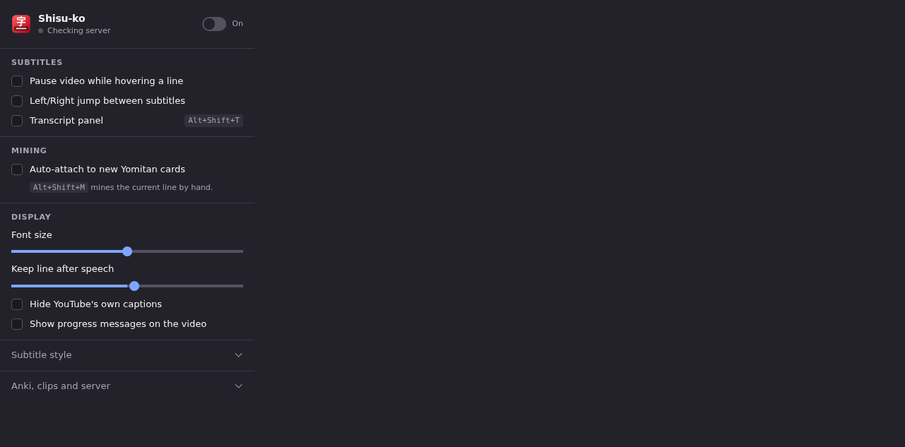
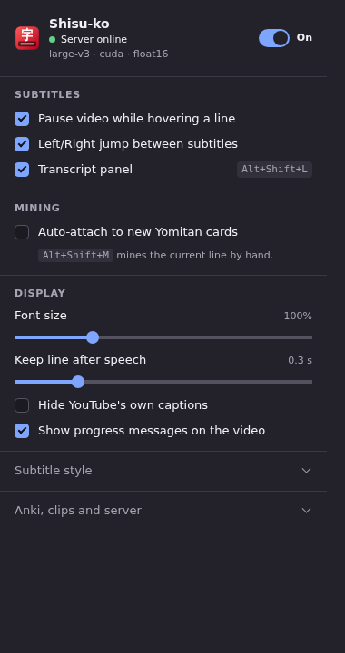
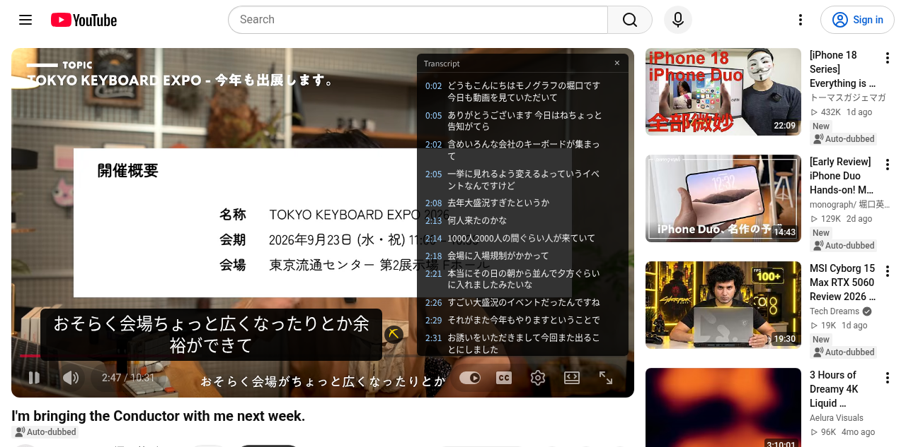

# Chrome verification

Before: Firefox release source `d115138` (0.4.0) loaded in Chromium, but the popup stayed on
“Checking server”. A settings message failed with “Could not establish connection. Receiving
end does not exist.” Chrome did not run the Firefox background scripts.

Verified 2026-09-18 in a private Xvfb display with headed Chromium 152 on the real YouTube
video [miM_yxQ2P20](https://www.youtube.com/watch?v=miM_yxQ2P20). The test used the generated
0.5.0 `dist/chrome` package. The running local server was 0.4.0, using large-v3 on CUDA with
float16; this release changes only its version number, not the server protocol.

After: the popup reported “Server online”, Japanese subtitles appeared as DOM text, the
transcript contained 141 rows, and hovering a subtitle paused playback.

The native shortcuts were pressed in Chromium and produced these observable results:

- `Alt+Shift+L`: transcript changed from `transcriptHidden=false` to `true`.
- `Alt+Shift+M`: showed the `Saved` toast and downloaded the sentence media. The MP3 was
  67,148 bytes and 5.54 seconds long; its filename included the original timestamp `166530`
  and a `(1)` suffix. The JPEG was 67,120 bytes.
- `Alt+Shift+S`: the subtitle overlay's computed display changed to `none`.

The shared transcript shortcut changed from `Alt+Shift+T` to `Alt+Shift+L` in both browsers.
Chrome reserves the old shortcut for focusing its toolbar. Firefox keeps its directly loadable
source manifest and native promise API.

The full Chrome harness also passed the service-worker restart case: after stopping the old
worker, a fresh worker resumed with persisted settings and a fresh Anki baseline. An Anki fixture
matching note `101` received both media files and field updates; mismatch note `202` performed no
writes. Real Anki GUI interaction was not tested.

The watch command was observed rebuilding after an addon edit. Both Nix addon targets built from
the same source.

Validation: 81 addon tests, two package tests, and 187 server tests passed. Firefox lint reported
zero errors and one existing Android minimum-version warning. The browser test also checked
native hover pause/resume, exact downloaded audio bytes, JPEG bytes, all three registered
shortcuts, and settings after worker suspension. `npm audit` reported zero vulnerabilities.

The GitHub ZIP is an unpacked Chrome installation, with manual updates. It is not a Chrome Web
Store listing. Real Anki GUI interaction was not tested; AnkiConnect was exercised through the
isolated HTTP fixture.
